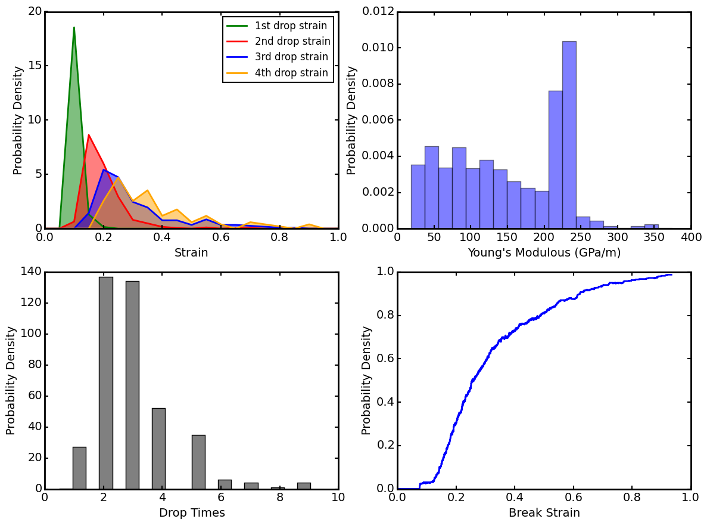
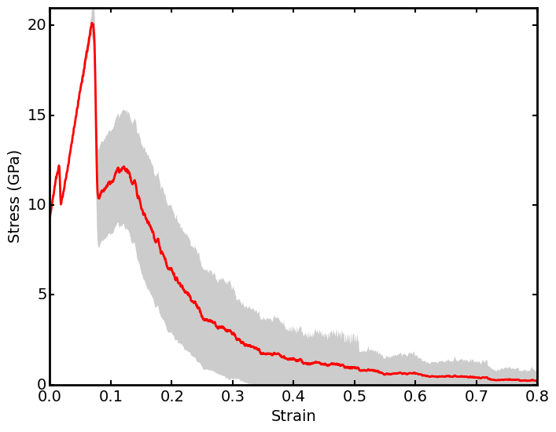

# Strain

## circle
apply strain cyclely

### left

> apply negative stress firstly and then positive. For different temperature but one sample

``` python
opt=dict(
	units="metal",
	species="graphene_knot",
	method="nvt",
	nodes=1,
	procs=4,
	queue="q1.4",
	runTime=500000
	,runner="strain"
)
for T in range(100,300,20):
	app=dict(vStrain=True,
	reverseStrain=True,
	equTime=200000,
	T=T,
	strainStep=1000,
	minStrain=0.05,
	maxStrain=-0.15,
	timestep=.3e-3,
	latx=70,
	laty=2)
	self.commit(opt,app);
```

### right

the same but 
``` python 
minStrain=-0.15,maxStrain=0.05 
```

### graphene 
>similar test for pure graphene

``` python
opt=dict(
	units="metal",
	species="graphene",
	method="nvt",
	nodes=1,
	procs=4,
	queue="q1.4",
	runTime=500000
	,runner="strain"
)
app=dict(reverseStrain=True,vStrain=True,
	maxStrain=0.1,minStrain=-0.1,equTime=000000,
	strainStep=1000,timestep=.5e-3,latx=30,laty=2)
self.commit(opt,app);
```

## graphene
> single direction straining of graphene

``` python
opt=dict(
	units="metal",
	species="graphene",
	method="nvt",
	nodes=1,
	procs=4,
	queue="q1.4",
	runTime=500000
	,runner="strain"
)
app=dict(reverseStrain=False,vStrain=True,
maxStrain=0.4,strainStep=1000,
timestep=.5e-3,latx=70,laty=2)
self.commit(opt,app);
```
## seed
> apply strain for different T and seed for single direction strain

``` python
opt=dict(
	units="metal",
	species="graphene_knot",
	method="nvt",
	nodes=1,
	procs=2,
	queue="q1.1",
	runTime=500000
	,runner="strain"
)
for T in range(100,300,40):
	for seed in range(100,110):
		app=dict(vStrain=True,seed=seed,equTime=200000,
		T=T,strainStep=1000,maxStrain=0.3,
		timestep=.3e-3,latx=70,laty=2)
		self.commit(opt,app);
```
`strain.py`

``` python 
datas=[]
c=[]
import pandas as pd
import numpy as np
from aces.tools import *
i=0
for T in range(100,300,40):
	for seed in range(100,110):
		#if not T==260:
		#	i+=1
		#	continue;
		df=pd.read_csv(str(i)+"/cal_stress.txt",sep=r"[ \t]",engine="python");
		datas.append([df['Strain'],df['Stress_GPa'],"seed="+str(seed)])
		c.append([df['Strain'],df['Stress_GPa']])
		i+=1
c=np.array(c)

from aces.graph import series,plot

series(xlabel='Strain',
	ylabel='Stress (GPa)',
	datas=datas
	,linewidth=1
	,filename='stress_strain.png',legend=False,grid=True)
x=c[:,0,:].mean(axis=0)
y=c[:,1,:].mean(axis=0)
plot([x,'Strain'],[y,'Stress (GPa)'],filename='ave_stress.png')
```
`times.py` 
> statistic the total break-up count of every simulation

``` python 
datas=[]
c=[]
import pandas as pd
import numpy as np

from aces.tools import *
breakstrains=[]
breaktimes=[]
def getBreakStrains(s):
	v=[]
	n=30
	for j,u in enumerate(s[n:-n,1]):
		var=abs(s[j+n,1]-s[j+n-1,1])
		if var>2.5 and var>s[j:j+n,1].std():
			if len(v)>0 and j-v[-1]< n : continue
			v.append(j+n)
	return np.array(v)
i=0
for T in range(100,300,40):
	for seed in range(100,110):
		s=np.loadtxt(str(i)+"/cal_stress.txt",skiprows=1)
		v=getBreakStrains(s)
		breakstrains.append(v)
		if abs(s[-1,1])<.5:
			breaktimes.append(len(v)) # break up
		else:
			breaktimes.append(-len(v)) #not break up
		i+=1
		print s[v,0],breaktimes[-1]
for u in s:
	pass

from aces.graph import series,plot

series(xlabel='Strain',
	ylabel='Stress (GPa)',
	datas=datas
	,linewidth=1
	,filename='stress_strain.png',legend=False,grid=True)
x=c[:,0,:].mean(axis=0)
y=c[:,1,:].mean(axis=0)
plot([x,'Strain'],[y,'Stress (GPa)'],filename='ave_stress.png')
```
## seed1

> anothor sampling of seed, so is seed2. and all the analysis is carried out in seed1 

`strain.py` just gives stress_strain.png and ave_stress.png for seed1 and seed2

`times.py` gives 
- drop_position.png
- young_distribution.png
- drop_times_dist.png
- break_strain_dist.png

### result




<style>img{background:white;width:100%;}</style>

## seed2

> just sub.py

## T

> huge calculation for temperature. use single structrue from data/POSCAR

``` python 
from aces import Aces
class sub(Aces):
	def submit(self):
		opt=dict(
			units="metal",
			species="graphene_knot",
			method="nvt",
			nodes=1,
			procs=1,
			queue="q1.1",
			runTime=500000
			,runner="strain"
		)
		for T in [50,500,1000]:
			for seed in range(200,400):
				app=dict(T=T,useMini=False,atomfile='POSCAR',
				vStrain=True,seed=seed,equTime=200000,
				strainStep=1000,maxStrain=0.9,
				timestep=.3e-3,latx=1,laty=1)
				self.commit(opt,app);
if __name__=='__main__':
	sub().run()
```

## loose

> The newest idea is to study the graphene->knot phase transition and we have to get a very loose sample. We expect the knot may not be release even for strain = -0.9. use single structrue from data/POSCAR

``` python 
from aces import Aces
class sub(Aces):
	def submit(self):
		opt=dict(
			units="metal",
			species="graphene_knot",
			method="nvt",
			nodes=1,
			procs=4,
			queue="q1.1",
			runTime=500000
			,runner="strain"
		)
		seed=100
		app=dict(useMini=False,atomfile='POSCAR',vStrain=True,seed=seed,equTime=200000,strainStep=1000,maxStrain=-0.9,timestep=.3e-3)
		self.commit(opt,app);
if __name__=='__main__':
	sub().run()

```


